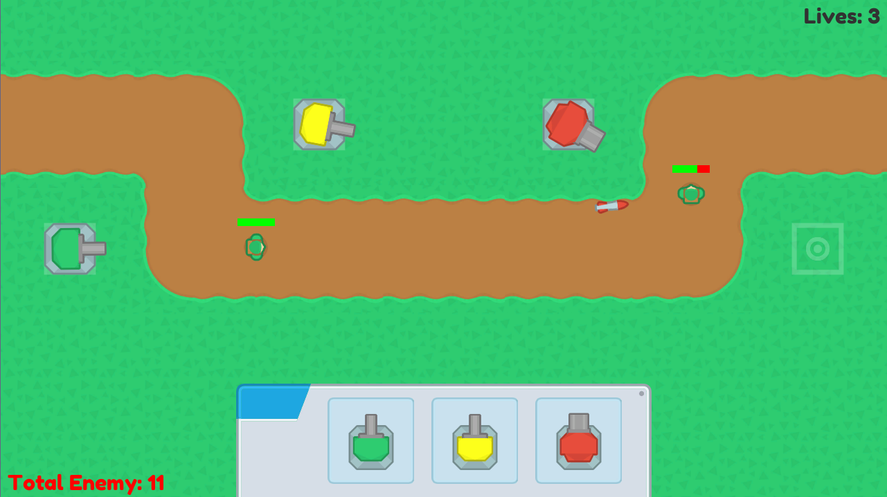

# Tower Defense

A game where you have to defend your lives by deploying the tower.

Project features:
1. Object Pooling
1. Singleton
1. Audio
1. Drag and drop object 

## Getting Started
1. Clone this repository to your computer/laptop
1. Open it with Unity (Recommended Unity 2018.3.3f1)
1. Play with it

## How to Install
1. Go to [Release tab](https://github.com/alfianAH/tower-defense/releases)
1. Choose between TowerDefense_x86.exe or TowerDefense_x64.exe. Choose the one that suits your computer/laptop. **Make sure it is the latest version.**
1. It will automatically download the file to your computer.
1. After downloading, play it by clicking on file. (Portable file in v1.1 or higher)
1. Done.

## Example Scene

